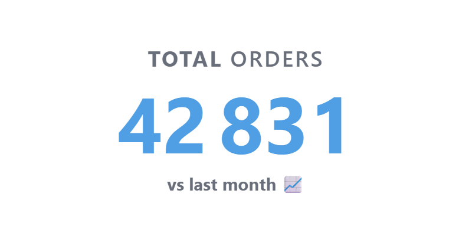

# Metric Card

A clean KPI card for Metabase that displays a single numeric metric with a configurable label and accent color. Supports dark mode automatically.



## Data requirements

The query must return **exactly 1 column and 1 row**.

| Column | Type | Description |
|--------|------|-------------|
| 1 | Numeric | The metric value to display |

**Example query:**
```sql
SELECT COUNT(*) FROM orders WHERE status = 'paid'
```

## Settings

| Setting | Type | Description |
|---------|------|-------------|
| Label | Text | Displayed above the number. Defaults to the column name. |
| Color | Color | Accent color for the number. Defaults to `#509EE3`. |

## Installation

1. Download the latest `.tgz` from [Releases](../../releases)
2. In Metabase: **Admin → Settings → Custom visualizations → Add**
3. Upload the `.tgz` file

## Requirements

- Metabase 1.62.0 or later
- Pro or Enterprise plan

## Development

```bash
npm install
npm run dev    # hot-reload against a local Metabase instance
npm run build  # produces metric-card-<version>.tgz
```

## License

MIT
